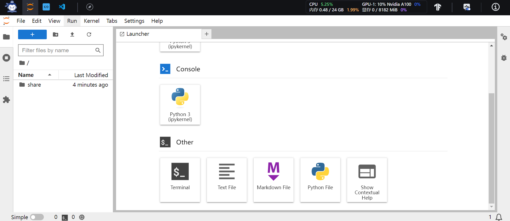
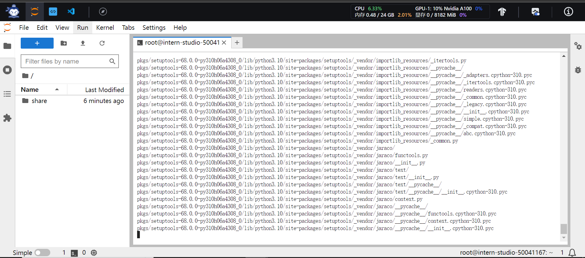

# # InternLM实战营第二期第二课笔记-书生·浦语大模型全链路开源体系

## 创建开发机
按照默认配置创建开发机：

进入开发机:


## 创建环境
进入jupter lab的terminal：

创建环境：
```bash
bash
bash /root/share/install_conda_env_internalLM_bash.sh internlm-demo
```

激活环境：
```bash
conda activate internlm-demo
```